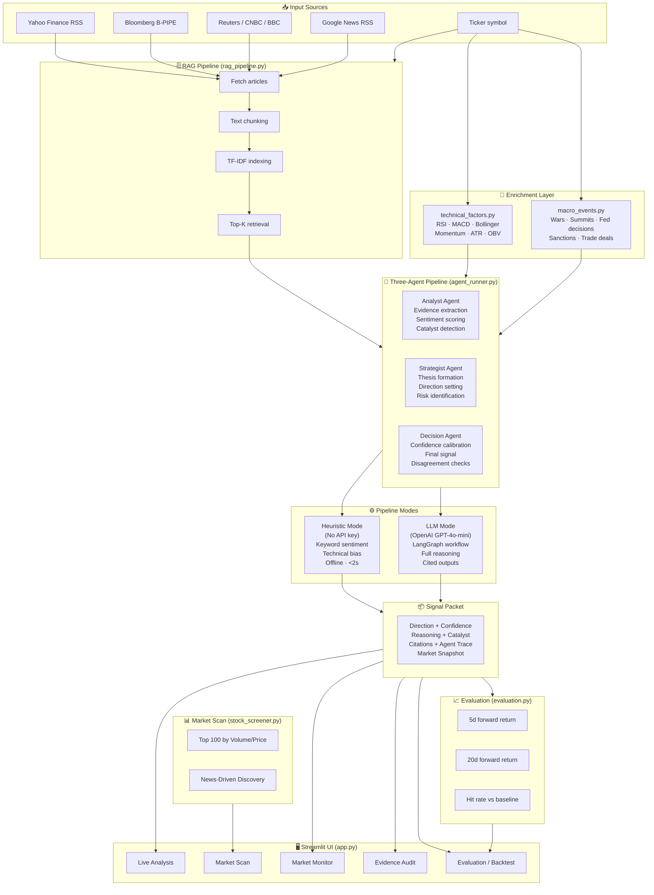

# FinSight RAG — Multi-Agent Financial News Intelligence

> Evidence-grounded signal generation, source audit, market reaction, and forward-return evaluation.

---

## Overview

FinSight RAG is a **retrieval-augmented generation (RAG) system** for institutional-quality financial signal generation. It ingests real-time news from major outlets, enriches context with quantitative technical factors and global macro intelligence, then routes all evidence through a structured **three-agent pipeline** (Analyst → Strategist → Decision) to produce directional investment signals with full source citation, confidence calibration, and backtest evaluation.

---

## System Architecture

```
╔══════════════════════════════════════════════════════════════════════════════════════════════╗
║                            FinSight RAG — Pipeline Architecture                              ║
╚══════════════════════════════════════════════════════════════════════════════════════════════╝

  INPUT SOURCES                 ENRICHMENT LAYER              AGENT PIPELINE          OUTPUT
  ─────────────                 ────────────────              ──────────────          ──────
                                                                                        
  ┌─────────────────┐           ┌──────────────────────┐                              
  │  News Ingester  │           │  Technical Factors   │     ┌──────────────┐         
  │                 │           │  technical_factors.py│     │   ANALYST    │         
  │  • Yahoo Finance│──────────▶│                      │────▶│    AGENT     │         
  │  • Bloomberg RSS│  raw text │  • RSI-14            │     │              │         
  │  • Reuters RSS  │           │  • MACD (12/26/9)    │     │  Evidence    │         
  │  • CNBC RSS     │           │  • SMA-20/50/200     │     │  extraction  │         
  │  • MarketWatch  │           │  • Bollinger Bands   │     │  Sentiment   │──────┐  
  │  • Google News  │           │  • ATR-14            │     │  scoring     │      │  
  │  • B-PIPE API   │           │  • Price Momentum    │     └──────────────┘      │  
  └─────────────────┘           │    (1w/1m/3m/6m)     │                           │  
           │                    │  • OBV Trend         │     ┌──────────────┐      │  
           ▼                    │  • 52w High/Low      │     │  STRATEGIST  │      │  
  ┌─────────────────┐           └──────────────────────┘     │    AGENT     │      │  
  │  RAG Pipeline   │                                         │              │◀─────┘  
  │  rag_pipeline.py│           ┌──────────────────────┐     │  Thesis      │         
  │                 │           │  Macro Events        │     │  formation   │         
  │  ① Ingest      │──────────▶│  macro_events.py     │────▶│  Direction   │──────┐  
  │  ② Chunk       │  retrieval│                      │     │  setting     │      │  
  │  ③ TF-IDF Index│           │  • Reuters World/Biz │     └──────────────┘      │  
  │  ④ Retrieve    │           │  • BBC World         │                            │  
  │    Top-K chunks│           │  • AP News           │     ┌──────────────┐      │  
  └─────────────────┘           │  • CNBC Economy/Pol  │     │   DECISION   │      │  
                                │  • MarketWatch       │     │    AGENT     │      │  
                                │  • Al Jazeera World  │     │              │◀─────┘  
                                │                      │     │  Confidence  │         
                                │  Dynamic search by:  │     │  calibration │         
                                │  • Ticker (FXI→China)│     │  Final signal│         
                                │  • Company name      │     └──────┬───────┘         
                                │  • Sector keywords   │            │                 
                                └──────────────────────┘            ▼                 
                                                                                       
  SIGNAL PACKET ◀──────────────────────────────────────────────────────────────────────
                                                                                       
  {                                                                                    
    ticker, direction (Bullish/Bearish/Neutral),                                      
    horizon_days (5d / 20d),                                                          
    confidence (0–1),                                                                  
    reasoning, catalyst,                                                              
    thesis_bullets, risk_factors,                                                     
    citations [ {source, title, excerpt, credibility_weight} ],                      
    agent_trace [ {agent, summary} ],                                                 
    market_snapshot { RSI, MACD, SMA, momentum, ... },                               
    sentiment_score, source_quality, novelty_score                                    
  }

  ┌──────────────────────────────────────────────────────────────────────────────────┐
  │                         STREAMLIT UI  (app.py)                                   │
  │                                                                                  │
  │  🔴 Live Analysis  │  📊 Market Scan  │  📈 Market Monitor  │  🔍 Evidence Audit  │  🔬 Evaluation  │
  └──────────────────────────────────────────────────────────────────────────────────┘
```

---

## Data Flow Diagram (Mermaid)



---

## File Structure

```
FinSight_RAG/
│
├── app.py                          # Streamlit UI — all 5 tabs, sidebar, CSS
├── run_analysis.py                 # CLI runner (no UI)
├── requirements.txt                # Python dependencies
├── .env.example                    # Environment variable template
│
├── .streamlit/
│   └── config.toml                 # Streamlit server config (fileWatcherType=none)
│
├── demo_data/
│   ├── signals.json                # Demo + live-generated signal packets
│   └── prices.csv                  # Historical price data for evaluation
│
└── src/finance_news_analyzer/
    ├── __init__.py
    ├── agent_runner.py             # ★ Core pipeline orchestrator
    ├── rag_pipeline.py             # News ingestion + TF-IDF retrieval
    ├── news_ingester.py            # RSS/Bloomberg article fetcher
    ├── technical_factors.py        # Quant factors (RSI, MACD, Bollinger…)
    ├── macro_events.py             # Geopolitical/macro news scanner
    ├── stock_screener.py           # Market scan (volume + news-driven)
    ├── evaluation.py               # Forward return + hit-rate computation
    ├── bloomberg_api.py            # B-PIPE API integration
    └── schemas.py                  # Pydantic data schemas
```

---

## Core Modules

### `agent_runner.py` — Pipeline Orchestrator ★

The central module that coordinates all stages of the pipeline.

| Function | Description |
|---|---|
| `run_full_pipeline(ticker, ...)` | **Main entry point.** Ingest → Enrich → RAG → Agents → Signal Packet |
| `_get_ticker_info(ticker)` | Fetch company name + sector via yfinance |
| `_get_market_snapshot(ticker)` | 30d price history, day change, volume ratio, P/E |
| `_get_technical_factors(ticker)` | Wrapper → `technical_factors.compute_technical_factors()` |
| `_get_macro_events(ticker, company, sector)` | Wrapper → `macro_events.fetch_macro_events()` |
| `_compute_technical_bias(factors)` | RSI/MACD/SMA → bullish/bearish/neutral bias + confidence adj |
| `_heuristic_analyst(chunks)` | Keyword scoring, catalyst extraction, evidence classification |
| `_heuristic_strategist(analyst, ticker, sector)` | Direction + thesis + risks from evidence balance |
| `_heuristic_decision(analyst, strategist, tech_bias)` | Confidence = base + strength + evidence + tech_adj |
| `run_heuristic_pipeline(ticker, chunks, sector, tech_bias)` | Offline 3-agent pipeline (<2s, no API key) |
| `run_llm_pipeline(ticker, chunks, ..., openai_api_key)` | GPT-4o-mini via LangGraph (person2 agent system) |
| `build_signal_packet(...)` | Assembles final JSON signal packet from agent outputs |
| `_build_citations(chunks)` | Formats source cards with clean excerpts for UI display |

**Synthetic context chunks injected into RAG context:**
- `_TechChunk` (credibility 0.85) — Full technical factor summary, marked `is_context_only=True` (excluded from heuristic sentiment scoring)
- `_MacroChunk` (credibility 0.92) — Top geopolitical/macro events, marked `is_context_only=True`

---

### `rag_pipeline.py` — News Ingestion & Retrieval

| Method | Description |
|---|---|
| `RAGPipeline.__init__(ticker, company, retrieval_query, top_k, ...)` | Configure pipeline for a ticker |
| `.ingest()` | Fetch articles from all configured sources |
| `.get_chunks(top_k)` | TF-IDF retrieval — returns top-K most relevant text chunks |
| `.article_count` | Total articles fetched |
| `.chunk_count` | Total text chunks indexed |
| `.source_names` | List of sources that contributed articles |

**Sources:** Yahoo Finance, Bloomberg, Reuters, CNBC, MarketWatch, Google News, B-PIPE (optional)

---

### `technical_factors.py` — Quantitative Factor Engine

| Function | Output | Formula |
|---|---|---|
| `compute_technical_factors(ticker)` | dict with `factors`, `summary`, `error` | Calls all sub-computations |
| **Price Momentum** | `mom_1w`, `mom_1m`, `mom_3m`, `mom_6m` | `(P_t - P_{t-n}) / P_{t-n}` |
| **RSI-14** | `rsi14` | EWM gain/loss ratio: `100 - 100/(1 + RS)` |
| **MACD (12/26/9)** | `macd_line`, `macd_signal`, `macd_histogram` | `EMA₁₂ - EMA₂₆`; signal = `EMA₉(MACD)` |
| **SMA Crossover** | `sma_cross` ("bullish/bearish/flat") | SMA-20 vs SMA-50 with ±0.5% threshold |
| **Bollinger Bands (20, 2σ)** | `bb_position` (0=low, 1=high), `bb_width` | `(Price - Lower) / (Upper - Lower)` |
| **ATR-14** | `atr_pct` | `mean(TR₁₄) / Price` where `TR = max(H-L, |H-C₋₁|, |L-C₋₁|)` |
| **Historical Vol** | `hist_vol_20d` | `std(log_returns₂₀) × √252` |
| **Volume Ratio** | `vol_5d_vs_20d` | `avg_vol(5d) / avg_vol(20d)` |
| **OBV Trend** | `obv_trend` ("rising/falling/flat") | Cumulative OBV 5d vs 20d mean ±2% |
| **52-Week Range** | `w52_high`, `w52_low`, `pct_from_52w_high` | Rolling 252d max/min |

---

### `macro_events.py` — Global Macro Intelligence

| Function | Description |
|---|---|
| `fetch_macro_events(ticker, company, sector, max_events)` | Scan 9 RSS feeds, return top geopolitical/macro events |
| `_build_search_terms(ticker, company, sector)` | Dynamic term derivation: static map + company name words + country detection + sector terms |
| `_keyword_score(text)` | Returns (tier1_hits, tier2_hits) for headline + summary |
| `_format_macro_summary(ticker, events)` | Structured LLM-injectable string with tier labels |

**Tier system:**
- **Tier-1** (direct market movers, score ×2): war, sanctions, summit, Fed rate decision, tariff, debt ceiling, election, executive order
- **Tier-2** (macro context, score ×1): GDP, CPI, PMI, OPEC, inflation, recession

**Dynamic search example:** `FXI` → `_get_ticker_info()` returns `"iShares China Large-Cap ETF"` → `_build_search_terms()` extracts `["fxi", "china", "ishares", "large"]` + detects "china" → adds `["china", "chinese", "beijing", "xi jinping", "renminbi", "yuan"]` → results in China-relevant headlines ranked first

---

### `stock_screener.py` — Market Scanner

| Function | Description |
|---|---|
| `top_stocks_by_market_activity(n, sort_by)` | Fetch NASDAQ-100 + S&P 500 universe, rank by volume/price/market-cap |
| `discover_stocks_from_news(n)` | Scan Yahoo/MarketWatch/Reuters/CNBC/Google RSS, extract ticker mentions, rank by frequency |
| `StockSnapshot` | Dataclass: ticker, company, price, day_change_pct, volume, volume_ratio, market_cap_b, news_mentions, sector |

---

### `evaluation.py` — Backtest Diagnostics

| Function | Description |
|---|---|
| `load_signals(path)` | Read signals.json into DataFrame |
| `load_prices(path)` | Read prices.csv into DataFrame |
| `attach_forward_returns(signals, prices)` | Join prices → compute 5d and 20d forward returns per signal |
| `build_metric_table(evaluated)` | Hit rate, avg signed return, coverage → comparison vs random/sentiment baselines |

**Hit rate definition:** `Bullish & ret > 0` OR `Bearish & ret < 0` OR `Neutral` → direction correct

---

### `bloomberg_api.py` — B-PIPE Integration

| Class/Function | Description |
|---|---|
| `BloombergConfig` | Dataclass: enabled, host, port, app_name |
| `check_bloomberg_connection(config)` | Test B-PIPE socket connection; returns (ok, message) |
| `fetch_bloomberg_news(ticker, config)` | Pull live news from Bloomberg B-PIPE for the ticker |

> **Note:** `blpapi` package is free to install but requires a licensed Bloomberg Terminal (localhost:8194) or enterprise B-PIPE subscription to connect.

---

## UI Tabs (app.py)

| Tab | Key Features |
|---|---|
| **🔴 Live Analysis** | Run full pipeline on any ticker; show signal card, market snapshot, evidence sources, agent trace, radar chart; save to signals.json |
| **📊 Market Scan** | Top 100 by Volume/Price (yfinance); News-Driven Discovery (RSS ticker mentions); "Save to Tickers" adds to sidebar dropdown |
| **📈 Market Monitor** | Index strip (SPY/QQQ/DIA/IWM); sector heatmap; Signal Queue; Market Pulse scatter; Disagreement Flags; AI Refresh |
| **🔍 Evidence Audit** | 8 broad market source cards (Semiconductors, Tech, Gold, Energy, Macro, EV, Financials, Consumer); per-card "🤖 Analyze" button runs AI for that theme's ETF; right column shows AI result + agent trace |
| **🔬 Evaluation** | Real yfinance 5d/20d forward returns; hit rate vs random/sentiment baselines; signal-level outcomes table |

---

## Signal Packet Schema

```json
{
  "id":               "sig-nvidia-xxxxxx",
  "ticker":           "NVDA",
  "company":          "NVIDIA Corporation",
  "sector":           "Technology",
  "benchmark":        "QQQ",
  "event_type":       "Bullish signals",
  "direction":        "Bullish",
  "horizon_days":     5,
  "confidence":       0.75,
  "novelty_score":    0.80,
  "sentiment_score":  0.65,
  "source_quality":   0.76,
  "published_at":     "2026-05-08T00:11:12Z",
  "reasoning":        "Full agent reasoning text...",
  "catalyst":         "Primary catalyst phrase",
  "thesis_bullets":   ["bullet 1", "bullet 2"],
  "risk_factors":     ["risk 1", "risk 2"],
  "counter_evidence": ["counter 1"],
  "watch_items":      ["watch 1"],
  "market_snapshot": {
    "last_price": 211.5,
    "day_change": 0.0177,
    "rsi14": 58.3,
    "macd_histogram": 0.0476,
    "sma_cross": "bullish (20 SMA > 50 SMA)",
    "mom_1m": 0.087,
    "bb_position": 0.70,
    "hist_vol_20d": 0.42,
    "pct_from_52w_high": -0.032
  },
  "citations": [
    {
      "source": "Reuters",
      "title": "...",
      "url": "...",
      "excerpt": "...",
      "credibility_weight": 0.85
    }
  ],
  "agent_trace": [
    {"agent": "Analyst Agent",    "summary": "..."},
    {"agent": "Strategist Agent", "summary": "..."},
    {"agent": "Decision Agent",   "summary": "Direction: Bullish. Confidence: 75%..."}
  ],
  "baseline_sentiment": "Bullish",
  "baseline_random":    "Neutral"
}
```

---

## Configuration

### Environment Variables (`.env`)

```bash
OPENAI_API_KEY=sk-...          # Optional — enables GPT-4o-mini agents
BLOOMBERG_HOST=localhost        # B-PIPE host (default: localhost)
BLOOMBERG_PORT=8194             # B-PIPE port (default: 8194)
```

### Streamlit Settings (⚙️ sidebar)

| Setting | Description |
|---|---|
| OpenAI API Key | Blank = heuristic offline mode; set = GPT-4o-mini LangGraph mode |
| Bloomberg B-PIPE | Toggle to enable B-PIPE news (requires license) |
| Ticker Settings | Session-only tickers (lost on reload) vs. disk-persisted (writes to signals.json) |

---

## Quick Start

```bash
# 1. Install dependencies
pip install -r requirements.txt

# 2. (Optional) Set API key
cp .env.example .env
echo "OPENAI_API_KEY=sk-..." >> .env

# 3. Launch
streamlit run app.py
```

---

## Agent Pipeline Modes

```
                        ┌─────────────────────────────────────────┐
                        │         run_full_pipeline(ticker)        │
                        └───────────────┬─────────────────────────┘
                                        │
                    ┌───────────────────▼──────────────────────┐
                    │              Enrichment                    │
                    │  tech_factors ──► _TechChunk (0.85)       │
                    │  macro_events ──► _MacroChunk (0.92)      │
                    │  RAG chunks   ──► top_k + 2 news chunks   │
                    └───────────────────┬──────────────────────┘
                                        │
                        ┌───────────────▼───────────────┐
                        │       openai_api_key?          │
                        └──────┬────────────────┬───────┘
                               │ NO              │ YES
                               ▼                 ▼
              ┌─────────────────────┐   ┌─────────────────────┐
              │   Heuristic Mode    │   │     LLM Mode         │
              │                     │   │                       │
              │ _heuristic_analyst  │   │ LangGraph workflow    │
              │ keyword scoring     │   │ GPT-4o-mini drives   │
              │                     │   │ all 3 agents          │
              │ _heuristic_         │   │                       │
              │ strategist          │   │ Falls back to         │
              │ balance-based       │   │ heuristic on error    │
              │ direction           │   │                       │
              │                     │   │ sys.modules swap      │
              │ _heuristic_decision │   │ for person2 agent     │
              │ conf = base +       │   │ system namespace      │
              │   strength +        │   │                       │
              │   evidence +        │   └──────────┬────────────┘
              │   tech_bias_adj     │              │
              └──────────┬──────────┘              │
                         └──────────┬──────────────┘
                                    ▼
                         ┌──────────────────┐
                         │  build_signal_   │
                         │  packet(...)     │
                         │                  │
                         │  sentiment_score │
                         │  = computed from │
                         │    RAG chunks    │
                         │    (LLM fallback)│
                         └──────────────────┘
```

---

## Confidence Calibration Formula

```
confidence = clip(base_conf + strength_adj + evidence_adj + tech_adj, 0.30, 0.90)

where:
  base_conf    = min(|avg_sentiment_score| × 1.6, 0.85)
  strength_adj = {"high": +0.10, "medium": 0.0, "low": −0.10}
  evidence_adj = +0.05 if supporting_evidence ≥ 3 else 0
  tech_adj     = ±0.015 × net_technical_score  (cap ±0.10)
               = +|adj| if tech_bias == news_direction (confirming)
               = −|adj| if tech_bias ≠ news_direction (contradicting)
```

---

## Evaluation Methodology — Full Explanation

### How Forward Returns Are Computed

Every signal packet has a `published_at` timestamp and a `ticker`. The Evaluation tab fetches 1-year price history from **yfinance** for each ticker and locates the trading day on or after `published_at` as the **entry date**. Entry price = closing price on that day.

```
entry_price  = Close[entry_date]
exit_5d      = Close[entry_date + 5 trading days]
exit_20d     = Close[entry_date + 20 trading days]

ret_5d  = (exit_5d  - entry_price) / entry_price
ret_20d = (exit_20d - entry_price) / entry_price
```

If a signal was published today, the 20d return is simply not yet available (`hit20d = None`).

### Hit Rate Definition

A signal **hits** (directional accuracy = 1) when:

| Signal Direction | Condition for Hit |
|---|---|
| **Bullish** | `ret_Nd > 0` (price rose) |
| **Bearish** | `ret_Nd < 0` (price fell) |
| **Neutral** | Always counts as a hit (abstain position) |

```
Hit Rate = (number of hits) / (number of signals with valid return data)
```

### Signed Return

**Signed return** weights the return by whether the direction was correct:

```
signed_ret = ret_Nd      if direction was correct (hit)
signed_ret = -ret_Nd     if direction was wrong  (miss)
```

A system with high conviction AND good accuracy will show a strongly positive avg signed return. A random system averages to ~0.

### Avg Raw Return

Mean absolute value of all returns `|ret_Nd|` across evaluated signals. Measures how volatile the underlying assets are — not whether the model was right.

---

### Baselines Explained

The Evaluation tab compares FinSight RAG against two reference baselines:

#### 1. Random Baseline (50% hit rate)

**Definition:** A system that randomly guesses Bullish, Bearish, or Neutral with equal probability.

**Expected hit rate:** 50% — because Neutral always hits, Bullish and Bearish each have ~50/50 chance of being correct.

**Purpose:** The floor. Any useful signal system must beat 50%.

**Avg signed return:** ~0.00% (random guesses cancel out over time)

```
P(hit | Bullish)  = P(price rises) ≈ 50%
P(hit | Bearish)  = P(price falls) ≈ 50%
P(hit | Neutral)  = 100%
Expected overall  ≈ 50%
```

#### 2. Sentiment Baseline (50% hit rate)

**Definition:** A system that reads the raw news sentiment score (keyword scoring of article text — the same `_score_chunk` heuristic used by the Analyst Agent) and generates a direction purely from that, **without** the Strategist or Decision agent layers.

**Why 50%?** News sentiment is noisy and frequently contradicted by price action. Raw positive sentiment doesn't reliably predict short-term price moves. The market often prices in news instantly (or the news is already stale).

**Purpose:** Shows how much value the multi-agent pipeline adds over simply reading sentiment. If RAG hit rate > sentiment hit rate, it means the full pipeline (tech factors + agent reasoning + source credibility weighting) is extracting signal beyond raw text positivity.

**Avg signed return:** `avg_raw_return × 0.5` (half the raw volatility, since it's right ~50% of the time)

---

### What "Good" Looks Like

| Metric | Interpretation |
|---|---|
| Hit rate > 55% | System has genuine predictive edge |
| Avg signed return > 0 | System makes money when correct more than it loses when wrong |
| Hit rate >> 50% with many signals | Strong evidence of alpha |
| Signal coverage < 50% | Many signals are too recent for evaluation; wait for returns to materialise |

**Important caveat:** Hit rate on a small sample (5–15 signals) has high variance. The Evaluation tab is most reliable with 20+ signals across diverse tickers.

---

### Evaluation Pipeline Step-by-Step

```
1. Load signals.json → filter out scan packets (no AI analysis)
2. Deduplicate: keep highest-confidence signal per ticker
3. For each signal:
   a. Look up ticker price history (1y) via yfinance
   b. Find entry date = first trading day ≥ published_at
   c. Compute ret_5d, ret_20d
   d. Classify as hit/miss per horizon
   e. Compute signed return
4. Aggregate:
   hit_rate_5d  = mean(hit5d)   for signals with valid 5d data
   hit_rate_20d = mean(hit20d)  for signals with valid 20d data
   avg_signed   = mean(signed)
   coverage     = len(valid) / len(all)
5. Compare to random baseline (50%) and sentiment baseline (50%)
```

---

## Credibility Weight Scale

| Source | Weight |
|---|---|
| Bloomberg | 0.95 |
| Wall Street Journal | 0.90 |
| Macro Events (FinSight) | 0.92 |
| Reuters | 0.85 |
| Technical Analysis (FinSight) | 0.85 |
| Barron's | 0.74 – 0.78 |
| CNBC | 0.78 |
| Yahoo Finance | 0.72 |
| Seeking Alpha | 0.65 |
| Google News | 0.50 – 0.65 |

---

## Dependency Map

```
app.py
 ├── src.finance_news_analyzer.agent_runner     (pipeline entry point)
 │    ├── src.finance_news_analyzer.rag_pipeline
 │    │    └── src.finance_news_analyzer.news_ingester
 │    │         └── src.finance_news_analyzer.bloomberg_api
 │    ├── src.finance_news_analyzer.technical_factors
 │    └── src.finance_news_analyzer.macro_events
 ├── src.finance_news_analyzer.stock_screener   (market scan)
 └── src.finance_news_analyzer.evaluation       (backtest)
      └── demo_data/signals.json + prices.csv

person2_agent_system_handoff/person2_agent_system/  (LLM agent system)
 ├── src/orchestration/workflow.py               (LangGraph MultiAgentWorkflow)
 ├── src/orchestration/memory_store.py           (signal memory)
 ├── src/llm/factory.py                          (GPT-4o-mini client)
 └── prompts/
      ├── analyst_prompt.txt
      ├── strategist_prompt.txt
      └── decision_prompt.txt
```

---

*Built for evidence-grounded investment research — not financial advice.*
