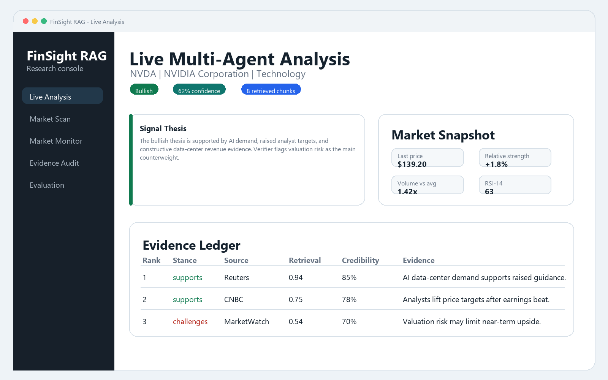
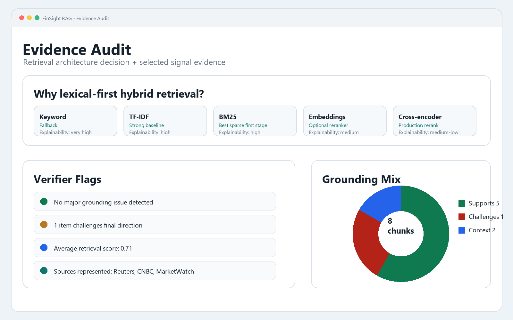
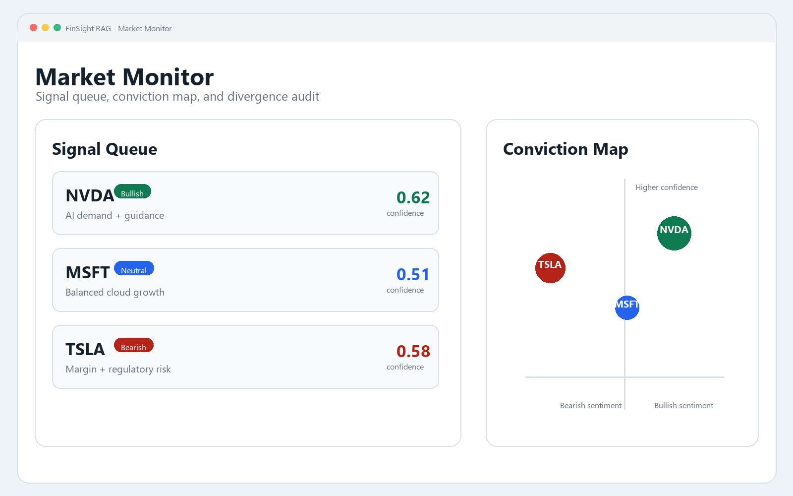
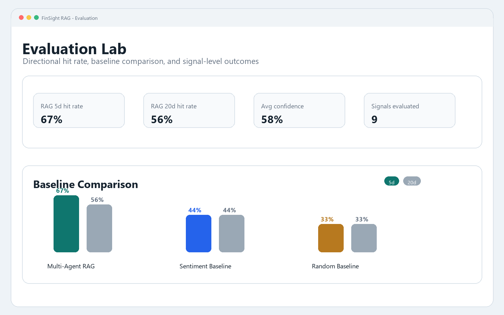
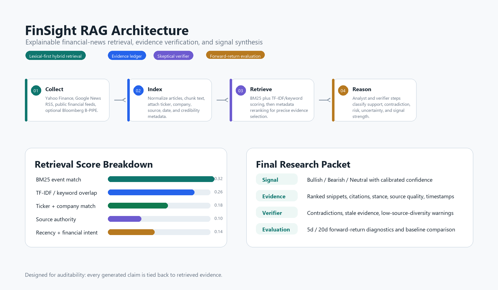

# FinSight RAG

Multi-agent financial news analysis with retrieval grounding, source audit, and forward-return evaluation.

[](https://www.python.org/)
[](https://streamlit.io/)
[](#system-architecture)
[](#project-artifacts)

FinSight RAG converts financial news into structured short-horizon investment hypotheses. It retrieves ticker-relevant evidence, enriches it with technical and macro context, routes it through a verifier-backed analyst workflow, and evaluates generated signals against realized 5-day and 20-day returns.

This is an educational research project. It is not financial advice.



## Quick Links

| Need | Where to Go |
|---|---|
| Run the interactive demo UI | See [Access the Demo UI](#access-the-demo-ui). |
| Read the final report | Open [`docs/final_report.pdf`](docs/final_report.pdf). |
| View the system architecture | See [System Architecture](#system-architecture). |
| See demo screenshots | See [Demo Gallery](#demo-gallery). |
| Check metrics and visualization inputs | See [Metrics and Visualization Assets](#metrics-and-visualization-assets). |

## Why This Project

Financial headlines are noisy. A positive article does not automatically imply a positive forward return, and simple sentiment scores usually miss source credibility, novelty, counter-evidence, and market context.

FinSight RAG was built to test a narrower question:

> Can a retrieval-grounded, multi-agent workflow produce more interpretable and testable financial signals than simple sentiment or random baselines?

## Key Features

- **Ticker-level live analysis** through a Streamlit dashboard.
- **RAG evidence retrieval** from Yahoo Finance and public RSS-style sources, with optional Bloomberg B-PIPE integration.
- **Explainable lexical-hybrid RAG retrieval** with BM25, TF-IDF/keyword fallback, ticker/company matching, source credibility, source authority, recency, and financial-intent scoring.
- **Seven-step research workflow**: News Retriever, Evidence Selector, Market Relevance Analyst, Risk / Sentiment Analyst, Skeptical Verifier, Signal Synthesizer, and Decision Agent.
- **Structured signal packets** with direction, confidence, catalyst, risks, counter-evidence, citations, and agent trace.
- **Evidence ledger** showing retrieved snippets, retrieval rank, score breakdown, stance versus the final signal, and verifier flags.
- **Technical and macro enrichment** using price indicators and macro/geopolitical event context.
- **Evidence audit view** for inspecting retrieved chunks and source credibility.
- **Forward-return evaluation** against random and keyword-sentiment baselines.
- **RAG quality testing** for retrieval relevance, completeness, correctness, groundedness, and coherence.

## Demo

### Access the Demo UI

The project UI is a local Streamlit dashboard. After setup, run:

```bash
cd FinSight_RAG
streamlit run app.py
```

Then open the local URL printed by Streamlit, usually `http://localhost:8501`.

The dashboard is designed as an evidence-first financial intelligence workstation, not a chat interface. It includes five main views:

| View | Purpose |
|---|---|
| Live Analysis | Run the full pipeline for a ticker and inspect the generated signal. |
| Market Scan | Discover tickers from market activity and news mentions. |
| Market Monitor | Track signal queue, market pulse, and disagreement flags. |
| Evidence Audit | Inspect retrieval architecture, ranked evidence, citations, and verifier flags. |
| Evaluation Lab | Compare multi-agent RAG signals against baselines. |

Demo media is organized in [`docs/demo/`](docs/demo/) and [`docs/screenshots/`](docs/screenshots/).

## Demo Gallery

| Live Analysis | Evidence Audit |
|---|---|
|  |  |

| Market Monitor | Evaluation Lab |
|---|---|
|  |  |

## Latest Technical Upgrade

The RAG layer now returns auditable retrieval diagnostics instead of opaque source cards. Each retrieved chunk carries a blended score and feature breakdown across semantic match, ticker/company match, source credibility, source authority, recency, and financial intent. The agent layer converts those chunks into an evidence profile with supporting/challenging/context counts and skeptical verifier flags.

See [`FinSight_RAG/docs/technical_audit.md`](FinSight_RAG/docs/technical_audit.md) for the project audit and [`FinSight_RAG/docs/retrieval_architecture.md`](FinSight_RAG/docs/retrieval_architecture.md) for the TF-IDF vs BM25 vs embedding tradeoff discussion.

## Project Artifacts

- [Final Report](docs/final_report.pdf)
- [Project Proposal](docs/project_proposal.pdf)
- [System Architecture Image](docs/screenshots/system-architecture.png)

## System Architecture



The implementation supports two execution modes:

| Mode | When to Use | Notes |
|---|---|---|
| Heuristic mode | Default local demo and reproducible testing | No API key required. Uses keyword/rule-based reasoning and technical bias. |
| LLM mode | Richer agent reasoning | Uses the included `person2_agent_system_handoff` workflow with an OpenAI API key. |

## Quick Start

```bash
git clone https://github.com/rf2960/finance-news-analyzer.git
cd finance-news-analyzer/FinSight_RAG
python -m venv .venv

# Windows
.venv\Scripts\activate

# macOS/Linux
source .venv/bin/activate

pip install -r requirements.txt
streamlit run app.py
```

The app opens at `http://localhost:8501`.

Optional environment setup:

```bash
cp .env.example .env
# Add OPENAI_API_KEY only if you want LLM-backed agents.
```

## Command-Line Usage

Run a single ticker in local heuristic mode:

```bash
cd FinSight_RAG
python run_analysis.py --ticker NVDA --verbose
```

Run with LLM-backed agents:

```bash
python run_analysis.py --ticker NVDA --openai-key sk-your-key --model gpt-4o-mini
```

Save a generated signal:

```bash
python run_analysis.py --ticker AAPL --save-signal
```

Run RAG quality tests:

```bash
python test_rag_quality.py --run-all-tests --save-results demo_data/rag_eval_results.json
```

Compare retrieval methods on deterministic sanity fixtures:

```bash
python retrieval_case_studies.py --method all --verbose
```

These case studies are regression fixtures, not live production metrics.

## Evaluation Snapshot

The final report currently includes:

| Evaluation | Current Status |
|---|---|
| Historical demo forward-return evaluation | Completed on bundled sample signals and prices. |
| 5-day / 20-day directional hit-rate comparison | Completed for the historical demo sample. |
| RAG retrieval and generation quality test | Completed on nine tickers. |
| Larger live-data evaluation | Future work once more signals have realized forward returns. |

The current numbers are intended as a project evaluation sample, not a production trading result.

## Metrics and Visualization Assets

The evaluation tables and charts shown in the report come from the bundled demo data and app evaluation view:

| Asset | Location | Use |
|---|---|---|
| Historical signal sample | [`FinSight_RAG/demo_data/evaluation_signals.json`](FinSight_RAG/demo_data/evaluation_signals.json) | Demo signals used for 5-day and 20-day forward-return evaluation. |
| Price sample | [`FinSight_RAG/demo_data/prices.csv`](FinSight_RAG/demo_data/prices.csv) | Price data used to attach realized returns to demo signals. |
| RAG quality results | [`FinSight_RAG/demo_data/rag_eval_results.json`](FinSight_RAG/demo_data/rag_eval_results.json) | Retrieval and generation quality metrics for the report. |
| Evaluation code | [`FinSight_RAG/src/finance_news_analyzer/evaluation.py`](FinSight_RAG/src/finance_news_analyzer/evaluation.py) | Computes directional hit rate, signed return, and baseline comparisons. |
| RAG quality test | [`FinSight_RAG/test_rag_quality.py`](FinSight_RAG/test_rag_quality.py) | Produces retrieval/generation quality results. |
| Retrieval case studies | [`FinSight_RAG/retrieval_case_studies.py`](FinSight_RAG/retrieval_case_studies.py) | Synthetic regression fixtures comparing keyword, TF-IDF, BM25, and hybrid retrieval. |

For visual inspection, run the Streamlit app and open the **Evaluation Lab** tab. That tab displays the metric charts used to support the report discussion.

## Repository Structure

```text
.
|-- README.md
|-- LICENSE
|-- docs/
|   |-- final_report.pdf
|   |-- project_proposal.pdf
|   |-- demo/
|   |-- screenshots/
|   |   |-- system-architecture.png
|   |   |-- live-analysis.png
|   |   |-- evidence-audit.png
|   |   |-- market-monitor.png
|   |   `-- evaluation-lab.png
|-- FinSight_RAG/
|   |-- app.py
|   |-- run_analysis.py
|   |-- test_rag_quality.py
|   |-- retrieval_case_studies.py
|   |-- requirements.txt
|   |-- .env.example
|   |-- demo_data/
|   |-- docs/
|   |   |-- retrieval_architecture.md
|   |   `-- technical_audit.md
|   `-- src/finance_news_analyzer/
|       |-- agent_runner.py
|       |-- rag_pipeline.py
|       |-- news_ingester.py
|       |-- technical_factors.py
|       |-- macro_events.py
|       |-- stock_screener.py
|       |-- evaluation.py
|       |-- bloomberg_api.py
|       `-- schemas.py
`-- person2_agent_system_handoff/
    `-- person2_agent_system/
```

`person2_agent_system_handoff` is retained because LLM mode imports that workflow for the Analyst/Strategist/Decision agent path.

## Tech Stack

- Python, Streamlit, Pandas, Plotly
- yfinance for market data
- feedparser and requests for news ingestion
- BM25 / TF-IDF / keyword lexical retrieval with metadata reranking
- Pydantic data models
- Optional LangGraph / LangChain / OpenAI path for LLM-backed agents

## Team

- Ruochen Feng
- Andrew Chen
- Yikai Li

## Future Work

- Build a labeled real-news retrieval benchmark before adding optional embedding or cross-encoder reranking.
- Add a larger live-data evaluation once more forward-return windows close.
- Integrate a domain-adapted sentiment model such as FinBERT.
- Expand beyond large-cap technology tickers.
- Add a short narrated demo video or GIF using the polished screenshot flow.

## Disclaimer

FinSight RAG is a research and class-project system for evaluating news-grounded signal generation. It should not be used as investment advice or as an automated trading system.
