# FinSight RAG

Multi-agent financial news analysis with retrieval grounding, source audit, and forward-return evaluation.

[](https://www.python.org/)
[](https://streamlit.io/)
[](#system-workflow)
[](#project-artifacts)

FinSight RAG converts financial news into structured short-horizon investment hypotheses. It retrieves ticker-relevant evidence, enriches it with technical and macro context, routes it through a three-stage analysis workflow, and evaluates generated signals against realized 5-day and 20-day returns.

This is an educational research project. It is not financial advice.

## Why This Project

Financial headlines are noisy. A positive article does not automatically imply a positive forward return, and simple sentiment scores usually miss source credibility, novelty, counter-evidence, and market context.

FinSight RAG was built to test a narrower question:

> Can a retrieval-grounded, multi-agent workflow produce more interpretable and testable financial signals than simple sentiment or random baselines?

## Key Features

- **Ticker-level live analysis** through a Streamlit dashboard.
- **RAG evidence retrieval** from Yahoo Finance and public RSS-style sources, with optional Bloomberg B-PIPE integration.
- **Three-stage reasoning workflow**: Analyst, Strategist, and Decision Agent.
- **Structured signal packets** with direction, confidence, catalyst, risks, counter-evidence, citations, and agent trace.
- **Technical and macro enrichment** using price indicators and macro/geopolitical event context.
- **Evidence audit view** for inspecting retrieved chunks and source credibility.
- **Forward-return evaluation** against random and keyword-sentiment baselines.
- **RAG quality testing** for retrieval relevance, completeness, correctness, groundedness, and coherence.

## Demo

The app includes five main views:

| View | Purpose |
|---|---|
| Live Analysis | Run the full pipeline for a ticker and inspect the generated signal. |
| Market Scan | Discover tickers from market activity and news mentions. |
| Market Monitor | Track signal queue, market pulse, and disagreement flags. |
| Evidence Audit | Review retrieved evidence, citations, and source credibility. |
| Evaluation Lab | Compare multi-agent RAG signals against baselines. |

Demo media placeholders are organized in [`docs/demo/`](docs/demo/) and [`docs/screenshots/`](docs/screenshots/). Add the final GIF/video or UI screenshots there before public release.

## Project Artifacts

- [Final Report](docs/final_report.pdf)
- [Project Proposal](docs/project_proposal.pdf)
- [Archived Project Plan](docs/archive/final_project_plan_0423.docx)

## System Workflow

```mermaid
flowchart LR
    A["Ticker / market event"] --> B["News ingestion"]
    B --> C["RAG retrieval<br/>TF-IDF + source weighting"]
    C --> D["Evidence enrichment<br/>technical factors + macro context"]
    D --> E["Analyst Agent<br/>extract claims and evidence"]
    E --> F["Strategist Agent<br/>build thesis and counter-evidence"]
    F --> G["Decision Agent<br/>direction + confidence"]
    G --> H["Signal packet<br/>citations + agent trace"]
    H --> I["Dashboard + evaluation"]
```



The implementation supports two execution modes:

| Mode | When to Use | Notes |
|---|---|---|
| Heuristic mode | Default local demo and reproducible testing | No API key required. Uses keyword/rule-based reasoning and technical bias. |
| LLM mode | Richer agent reasoning | Uses the included `person2_agent_system_handoff` workflow with an OpenAI API key. |

## Quick Start

```bash
git clone https://github.com/rf2960/finance-news-analyzer.git
cd finance-news-analyzer/FinSight_RAG
python -m venv .venv

# Windows
.venv\Scripts\activate

# macOS/Linux
source .venv/bin/activate

pip install -r requirements.txt
streamlit run app.py
```

The app opens at `http://localhost:8501`.

Optional environment setup:

```bash
cp .env.example .env
# Add OPENAI_API_KEY only if you want LLM-backed agents.
```

## Command-Line Usage

Run a single ticker in local heuristic mode:

```bash
cd FinSight_RAG
python run_analysis.py --ticker NVDA --verbose
```

Run with LLM-backed agents:

```bash
python run_analysis.py --ticker NVDA --openai-key sk-your-key --model gpt-4o-mini
```

Save a generated signal:

```bash
python run_analysis.py --ticker AAPL --save-signal
```

Run RAG quality tests:

```bash
python test_rag_quality.py --run-all-tests --save-results demo_data/rag_eval_results.json
```

## Evaluation Snapshot

The final report currently includes:

| Evaluation | Current Status |
|---|---|
| Historical demo forward-return evaluation | Completed on bundled sample signals and prices. |
| 5-day / 20-day directional hit-rate comparison | Completed for the historical demo sample. |
| RAG retrieval and generation quality test | Completed on nine tickers. |
| Larger live-data evaluation | Future work once more signals have realized forward returns. |

The current numbers are intended as a project evaluation sample, not a production trading result.

## Repository Structure

```text
.
|-- README.md
|-- LICENSE
|-- docs/
|   |-- final_report.pdf
|   |-- project_proposal.pdf
|   |-- demo/
|   |-- screenshots/
|   `-- archive/
|-- FinSight_RAG/
|   |-- app.py
|   |-- run_analysis.py
|   |-- test_rag_quality.py
|   |-- requirements.txt
|   |-- .env.example
|   |-- demo_data/
|   |-- docs/
|   `-- src/finance_news_analyzer/
|       |-- agent_runner.py
|       |-- rag_pipeline.py
|       |-- news_ingester.py
|       |-- technical_factors.py
|       |-- macro_events.py
|       |-- stock_screener.py
|       |-- evaluation.py
|       |-- bloomberg_api.py
|       `-- schemas.py
`-- person2_agent_system_handoff/
    `-- person2_agent_system/
```

`person2_agent_system_handoff` is retained because LLM mode imports that workflow for the Analyst/Strategist/Decision agent path.

## Tech Stack

- Python, Streamlit, Pandas, Plotly
- yfinance for market data
- feedparser and requests for news ingestion
- scikit-learn TF-IDF retrieval
- Pydantic data models
- Optional LangGraph / LangChain / OpenAI path for LLM-backed agents

## Team

- Ruochen Feng
- Andrew Chen
- Yikai Li

## Future Work

- Replace TF-IDF retrieval with a dense vector index such as FAISS or Chroma.
- Add a larger live-data evaluation once more forward-return windows close.
- Integrate a domain-adapted sentiment model such as FinBERT.
- Expand beyond large-cap technology tickers.
- Add final demo video, GIF, and polished screenshots.

## Disclaimer

FinSight RAG is a research and class-project system for evaluating news-grounded signal generation. It should not be used as investment advice or as an automated trading system.
